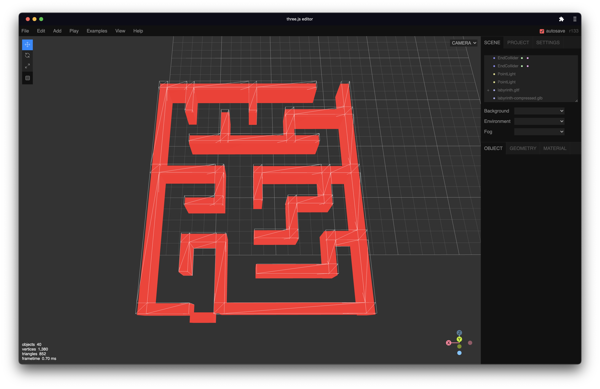

# 3D Game

The 3D mini-game created in the MR-CLIENT service is built via Three.js. In order to use Three.js in a declarative way together with React.js, I'm using the React-Three-Fiber library, a custom React renderer for creating highly efficient Three.js applications inside a React application. You can read more about the React-Three-Fiber library [here](https://docs.pmnd.rs/react-three-fiber/getting-started/introduction).

## Constraints

Since I'm using Next.js as the React.js framework, I need to exclude every 3D scene from the server-side build process of Next.js. Therefore I need to dynamically include the React-Three-Fiber components inside the pages to hydrate the 3D scenes/components. Here's how this looks like:

```typescript
const GameScene = dynamic(() => import("../components/scenes/GameScene"), {
  ssr: false,
});
```

Afterwards, I can typically include the 3D part of the app as a JSX component inside the rest of the page.

## Physics

As the physics engine, I'm using the [use-cannon](https://github.com/pmndrs/use-cannon) library, which provides React hooks for the [Cannon ES](https://pmndrs.github.io/cannon-es/docs/index.html) rigid-body physics engine. Since I have a "complex" mesh for the labyrinth, I needed to create a set of primitive objects for the physics engine (e.g. walls and end collider).

For that, I created a setup of boxed inside the [Three.js Editor](https://threejs.org/editor), this is how it looks like:



After visually aligning the red boxes accordingly to the labyrinth mesh, I used the values provided by the editor to create an array of primitives for the physics engine. Have a look at the `labyrinthColliderArray.ts` file for more information.
